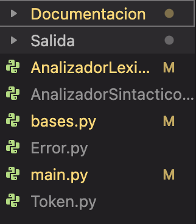
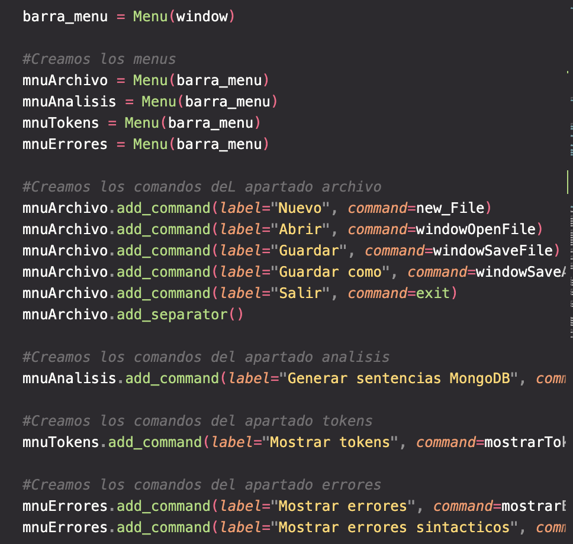
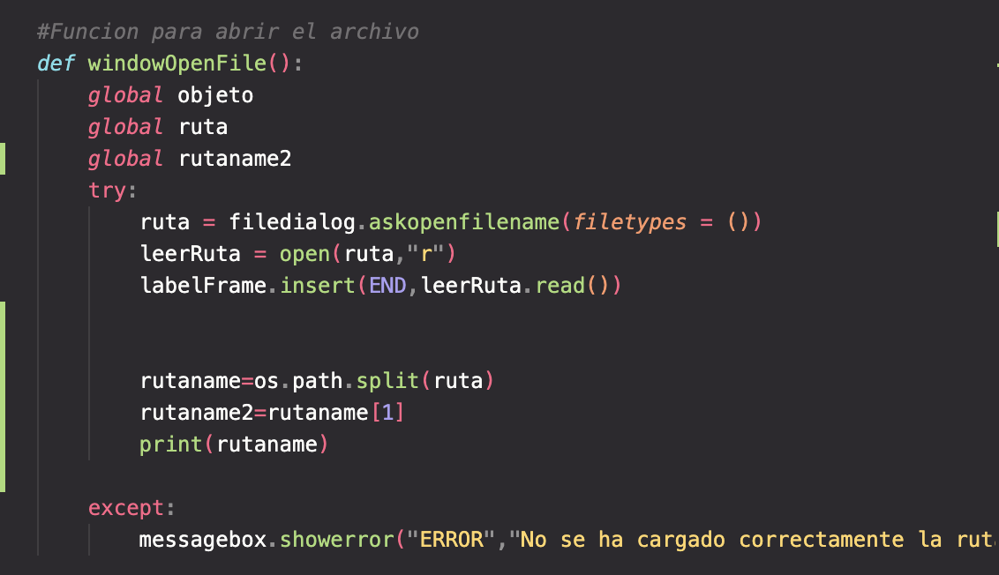
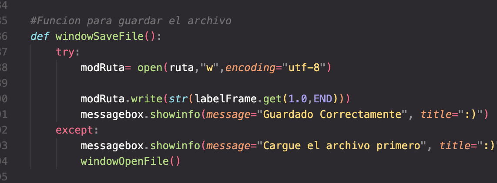
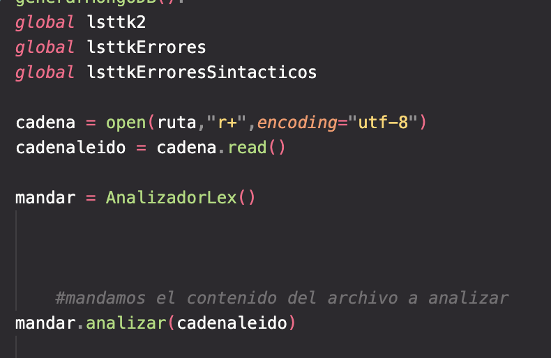
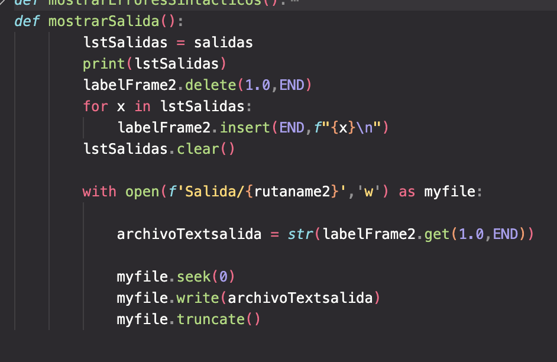

###### Sebastian Solares 202004822

## Lenguaje utilizado
Python es un lenguaje de alto nivel de programacion se utiliza para desarollar aplicaciones de todo tipo, como: netflix, panda 3D,entro otros.

# Codigo
## clases

El programa cuenta con 6 clases, una que es el analizador lexico, sintactico, token que es el metodo constructor para almacelar la lista de tokens igualmente la clase error que es otro constructor donde se almacena la lista de errores, bases que es la clase donde se traduce el archivo de entrada,main que es donde se ejecuta la app.

## Interfaz grafica
Es lo primero que se ejecuta en la app, se muestarn los botones, listas etc.

## Abrir archivo
con esta funcion podemos abrir el archivo de entrada que deseamos para luego obtener su ruta, leer lo que contiene dentro para luego mostrar esa informacion en una caja de texto.

## Guardar archivo
Con esta funcion podemos guardar las modificaciones que hemos realizado en la caja de texto, se guardara esta informacion en el archivo anterior mente cargado.

## Generar MongoDB
en esta funcion obtenemos la cadena del archivo de entrada y la mandamos al archivo analizadorLexico.py para que realice el analizador lexico para luego almacenar la lista de tokens y esa lista mandarla al analizador sintactico para realizar el analizador sintactico.

## Mostrar Salida
esta funcion lo que hace es crear el archivo de salida, obteniendo los comandos para luego abrir un fichero y almacenar dichos comandos.

# TABLA DE TOKENS

| Nombre                     | Descripción del patrón                                | Expresión regular | ejemplos                |
| -------------------------- | ----------------------------------------------------- | ----------------- | ----------------------- |
| Cadena                     | Una cadena de caracteres encerrada en comillas dobles | \\"[^.\\"]\*\\"   | "1" "ejemplo-1" ":v v:" |
| Punto                      | Un caracter '.'                                       | '.'               | .                       |
| ParentesisIzquierdo        | Un caracter '('                                       | '('               | (                       |
| ParentesisDerecho          | Un caracter ')'                                       | ')'               | )                       |
| llaveIzquierda             | Un caracter '{'                                       | '{'               | {                       |
| llaveDerecha               | Un caracter '}'                                       | '}'               | }                       |
| Dospuntos                  | Un caracter ':'                                       | ':'               | :                       |
| comillasDobles             | Un caracter '"'                                       | '"'               | "                       |
| puntoYcoma                 | Un caracter ';'                                       | ';'               | ;                       |
| Coma                       | Un caracter ','                                       | ','               | ,                       |
| CrearBD                    | palabra CrearBD                                       | CrearBD           | CrearBD                 |
| EliminarBD                 | palabra EliminarBD                                    | EliminarBD        | EliminarBD              |
| CrearColeccion             | palabra CrearColeccion                                | CrearColeccion    | CrearColeccion          |
| EliminarColeccion          | palabra EliminarColeccion                             | EliminarColeccion | EliminarColeccion       |
| InsertarUnico              | palabra InsertarUnico                                 | InsertarUnico     | InsertarUnico           |
| ActualizarUnico            | palabra ActualizarUnico                               | ActualizarUnico   | ActualizarUnico         |
| EliminarUnico              | palabra EliminarUnico                                 | EliminarUnico     | EliminarUnico           |
| BuscarTodo                 | palabra BuscarTodo                                    | BuscarTodo        | BuscarTodo              |
| BuscarUnico                | palabra BuscarUnico                                   | BuscarUnico       | BuscarUnico             |
| nueva                      | palabra nueva                                   | nueva             | nueva                   |
| Un número entero sin signo | Al menos un dígito                                    | \d+               | 3,12,65                 |

# Gramatica libre de contexto
SINTACTICO:
    init : instrucciones

    instrucciones : instruccion instrucciones
                | instruccion

    instruccion : crearDB ;
                | eliminarDB ; 
                | crearColeccion ;
                | eliminarColeccion ;
                | insertarUnico ;
                | actualizarUnico ;
                | eliminarUnico ;
                | buscarTodo ;
                | buscarUnico ;

    crearDB : CrearDB ID = nueva CrearDB ( )

    eliminarDB : EliminarDB ID = nueva EliminarDB ( )

    crearColeccion : CrearColeccion ID = nueva CrearColeccion ( STRING )

    eliminarColeccion : EliminarColeccion ID = nueva EliminarColeccion ( STRING )

    insertarUnico : InsertarUnico ID = nueva InsertarUnico ( STRING , STRING )

    actualizarUnico : ActualizarUnico ID = nueva ActualizarUnico ( STRING , STRING )

    eliminarUnico : EliminarUnico ID = nueva EliminarUnico ( STRING )

    buscarTodo : BuscarTodo ID = nueva BuscarTodo ( STRING )

    buscarUnico : BuscarUnico ID = nueva BuscarUnico ( STRING )