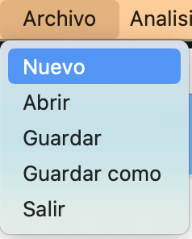
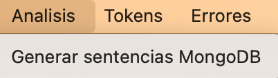
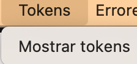
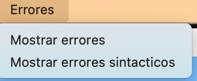
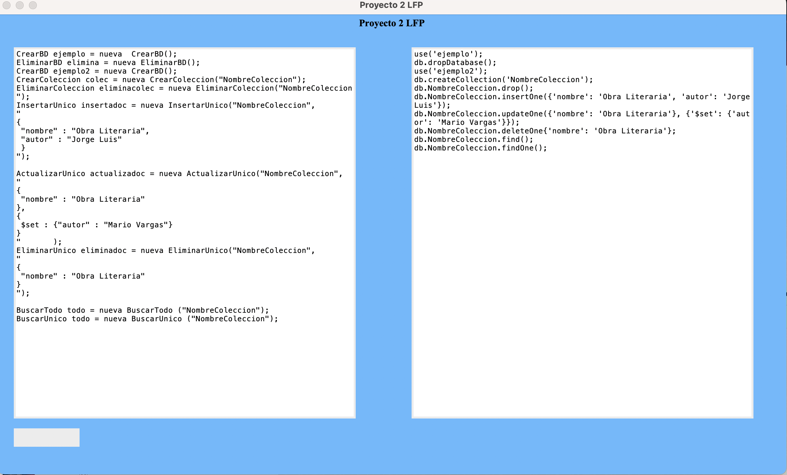
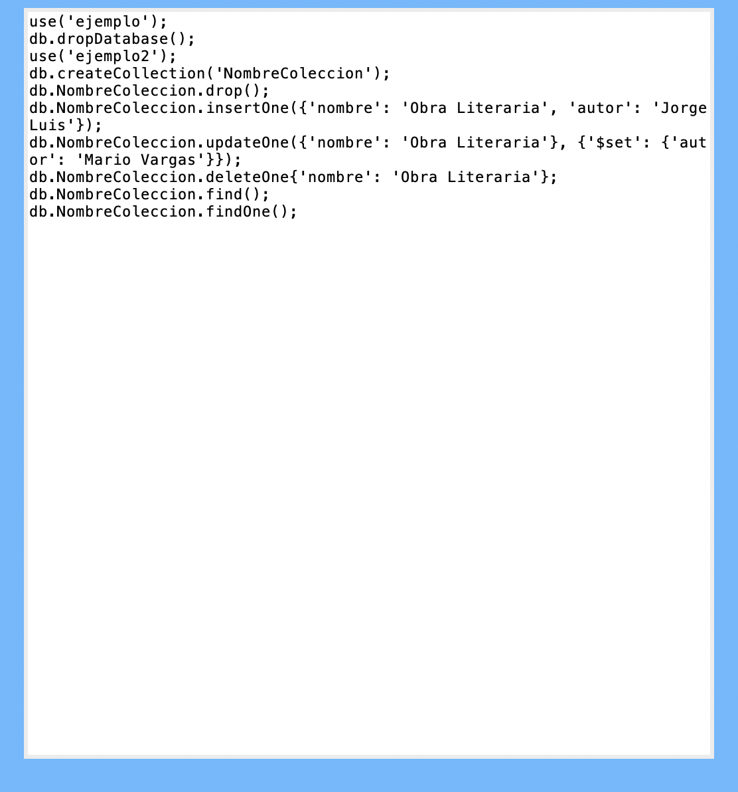

# Manual de usuario
## Informacion acerca del programa
Este proyecto consiste en la elaboracion de una herramienta que permita el diseño y creación de sentencias de bases de datos no relacionales de una forma sencilla. La aplicación tendrá un área de edición de código y un área de visualización de la sentencia final generada.

## Menu principal
El menu principal esta conformado por varias opciones. como por ejemplo crear un nuevo archivo, guardar, guardar como, analizar sentencias mongoDB, mostrar tokens, errores,etc.

## Apartado archivo
en este apartado podes crear un nuevo archivo, abrir un archivo, como tambien guardarlo y guardarlo en una ruta especifica.

## Apartado analisis
En este apartado podemos analizar el archivo de entrada para generar nuestros tokens o errores sin este caso existieran, tambien se analizara lo sintactico para que al final traduzca el archivo de entrada si no existieran errores

## Apartado Tokens
En este apartado podemos ver todos los tokens luego de analizar el archivo de entrada, mostrara una tabla con todos los tokens obtenidos.

## Apartado de Erroes
En este apartado podemos ver todos los errores que se puedan encontrar a la hora de analizar, los errores pueden ser lexicos y sintacticos, y se muestran en una tabla.

## Analisis
Cuando se analiza el archivo de entrada podemos observar los comandos que se van ejecutar en mongoDB, en el label derecho tambien se genera un archivo de salida en la carpeta Salida.

## Archivo de salida
