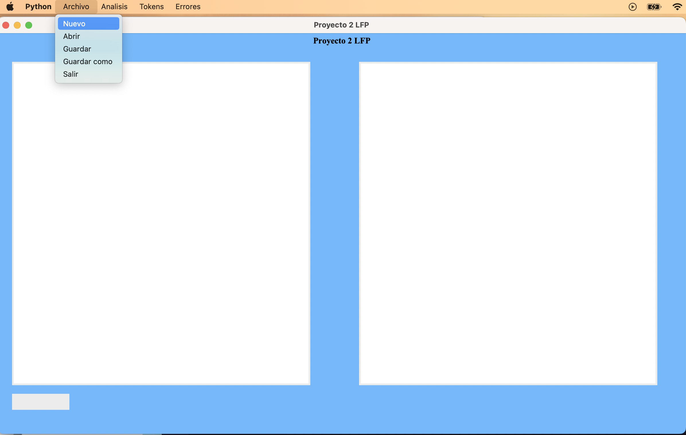

# Manual de usuario
## Informacion acerca del programa
Este proyecto consiste en la elaboracion de una herramienta que permita el diseño y creación de sentencias de bases de datos no relacionales de una forma sencilla. La aplicación tendrá un área de edición de código y un área de visualización de la sentencia final generada.

## Menu principal
El menu principal esta conformado por varias opciones. como por ejemplo crear un nuevo archivo, guardar, guardar como, analizar sentencias mongoDB, mostrar tokens, errores,etc.

